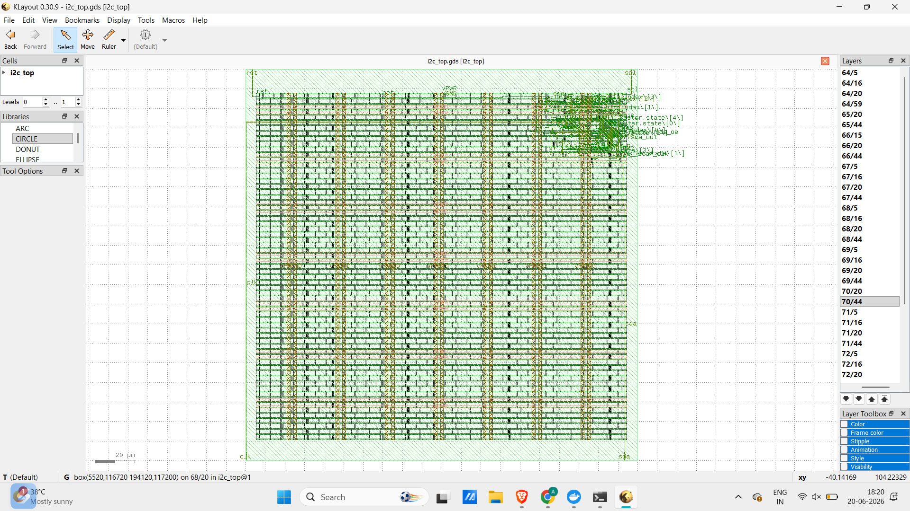

# I2C Controller — RTL to GDSII Physical Design

A complete **RTL-to-GDSII physical design flow** for an **I2C master–slave communication controller**, implemented in **Verilog HDL** and taken through **synthesis, floorplanning, placement, clock tree synthesis, routing, and signoff** using the **OpenLane** flow on the open-source **SKY130 PDK**.

---

## Project Overview

**I2C (Inter-Integrated Circuit)** is a widely used two-wire serial communication protocol using:

* **SDA** → Serial Data Line
* **SCL** → Serial Clock Line

This project implements a synthesizable **I2C master-slave pair in Verilog** and carries it through a complete **physical design flow**, producing a manufacturable **GDSII layout** — the same category of output delivered to a semiconductor foundry.

> This is an educational open-source implementation intended to demonstrate a complete RTL-to-GDSII methodology using free EDA tools. It is **not a commercial tapeout**.

---

## Design Flow

```text
RTL Design
    ↓
Functional Simulation
    ↓
Logic Synthesis
    ↓
Floorplanning
    ↓
Placement
    ↓
Clock Tree Synthesis (CTS)
    ↓
Routing
    ↓
Parasitic Extraction
    ↓
Static Timing Analysis
    ↓
DRC / LVS Verification
    ↓
GDSII Generation
```

---

## Tools and Technology

| Stage                                           | Tool                              |
| ----------------------------------------------- | --------------------------------- |
| RTL Design                                      | Verilog HDL                       |
| Functional Simulation                           | ModelSim                          |
| Synthesis                                       | Yosys                             |
| Floorplanning / Placement / CTS / Routing / STA | OpenROAD                          |
| Physical Verification                           | Magic, KLayout                    |
| Process Design Kit                              | SKY130A (SkyWater 130nm Open PDK) |
| Flow Orchestration                              | OpenLane v1.0.2                   |

---

## Project Structure

```text
project_root/
│
├── src/
│   ├── master.v        # Synthesizable I2C master FSM
│   ├── slave.v         # I2C slave receiver with SCL edge detection
│   └── i2c_top.v       # Top module with tristate SDA logic
│
├── config.json         # OpenLane configuration
│
└── README.md
```

### Master FSM States

```text
IDLE
   ↓
START
   ↓
SEND
   ↓
STOP
   ↓
DONE
```

---

## RTL Modifications for Synthesis

The original behavioral Verilog contained simulation-only constructs:

* `#delay` statements
* `inout reg`

These were converted into synthesizable RTL:

### Changes made

* Replaced `#delay` constructs with **clock-edge-driven state transitions**
* Split bidirectional SDA into:

```verilog
sda_out
sda_oe
```

* Implemented tristate buffering only in the top module:

```verilog
assign sda = sda_oe ? sda_out : 1'bz;
```

---

## Physical Design Results

**Default configuration:** 100 MHz

| Metric               | Value                    |
| -------------------- | ------------------------ |
| Die area             | 0.04 mm² (200µm × 200µm) |
| Standard logic cells | 59                       |
| Total physical cells | ~1,650                   |
| Clock frequency      | 100 MHz                  |
| Critical path delay  | 1.29 ns                  |
| Setup violations     | 0                        |
| Hold violations      | 0                        |
| DRC violations       | 0                        |
| LVS errors           | 0                        |
| Technology node      | SKY130 (130nm)           |

---

## Signoff Summary

All major implementation stages completed successfully:

✅ Synthesis
✅ Floorplanning
✅ Placement
✅ Clock Tree Synthesis
✅ Routing
✅ Parasitic Extraction
✅ Multi-corner STA
✅ IR Drop Analysis
✅ DRC Verification
✅ LVS Verification
✅ GDSII Streamout

Magic and KLayout outputs were cross-checked with:

```text
XOR difference = 0
```

---

## Synthesized Cell Composition

The **59 logic cells** consist primarily of:

### Sequential Cells

* `dfstp`
* `dfrtp`

Used for:

* FSM state registers
* Bit index registers

### Combinational Cells

* `mux2`
* Inverters
* `a21o`
* `o211a`
* `a2111o`
* Other synthesized compound gates

### I/O Cell

* `ebufn`

Used for:

* SDA tristate implementation

---

The remaining ~1,590 cells are automatically inserted:

* Decap cells
* Fill cells
* Tap cells

These are required for:

* Power integrity
* Density rules
* Latch-up prevention

and are not part of the functional logic.

---

## Clock Frequency Exploration

Timing was evaluated by sweeping clock constraints beyond the default configuration.

| Clock Period | Frequency | Result |
| ------------ | --------- | ------ |
| 10 ns        | 100 MHz   | Pass   |
| 5 ns         | 200 MHz   | Pass   |
| 1 ns         | 1 GHz     | Fail   |

### Observation at 1 GHz

The asynchronous reset path (`rst`) became timing critical.

Approximate reset propagation delay:

```text
0.4–0.6 ns
```

This produced:

* Removal violations
* Recovery violations

on several flip-flop reset pins.

OpenLane automatically inserted delay buffers:

```text
dlygate4sd3
```

which fixed several hold issues, but some violations remained.

This indicates that additional reset optimization would be required to support clock frequencies approaching **1 GHz**.

---

### Timing Conclusion

The design successfully closes timing up to at least:

```text
200 MHz
```

with the practical operating limit lying somewhere between:

```text
200 MHz → 1 GHz
```

---

## Layout

GDSII layout viewed in KLayout showing:

* Power distribution grid
* Standard-cell rows
* Routed signal layers
* Clock network

> Screenshot to be added

```text
final_layout.png
```

Example:

```markdown

```

---

## Key Learnings

* Converting behavioral Verilog into synthesizable RTL requires removal of simulation-only constructs.

* Bidirectional interfaces should be modeled using explicit output-enable logic.

* Reading OpenSTA reports requires distinguishing:

  * Setup/Hold checks
  * Recovery/Removal checks

* Clock Tree Synthesis balances clock delay and skew across sequential elements.

* Timing closure depends on actual gate and routing delays, not only on clock constraints.

* Increasing clock frequency alone does not guarantee functionality; physical propagation delays remain technology-limited.

---

## Future Improvements

* Add complete ACK/NACK handling
* Multi-byte transfer support
* Support repeated-start conditions
* Add configurable clock divider
* Explore timing optimization beyond 200 MHz
* Integrate formal verification

---

## References

* SKY130 Open PDK
* OpenLane Documentation
* OpenROAD Project
* I2C Protocol Specification

